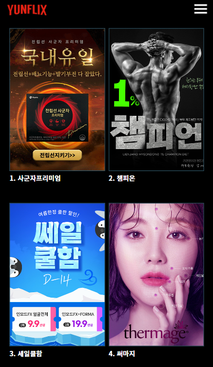

# 🎬 Yunflix - 오윤식 포트폴리오

안녕하세요! 웹 퍼블리셔이자 웹 디자이너 오윤식입니다.  
Yunflix는 저의 웹 퍼블리싱 역량과 디자인 감각을 담은 포트폴리오 사이트입니다.

## 📌 프로젝트 소개

YUNFLIX는 평소 영화를 즐겨보고, 드라마 좋아해서 포트폴리오도 이렇게 만들어보면 어떨까 해서 취미에서 출발한 프로젝트입니다.  
Netflix의 UI/UX를 참고해 제작하였으며, 프론트엔드 실무 역량을 키우기 위한 학습 목적도 포함되어 있습니다.

## 🎯 개발 배경 및 동기

> "내가 좋아하는 콘텐츠만 깔끔하게 모아보고 싶다!"  
  
> 디자이너로서의 감성과 개발자로서의 실험정신을 결합해 만든 프로젝트입니다.  
> 디자인은 사용성과 감성을 모두 고려했으며, 코드 구조는 확장 가능하게 구성하려 노력했습니다.

- 🎨 퍼블리싱 및 디자인 중심 프로젝트
- 💻 HTML, CSS, SCSS, JavaScript 사용
- 🧩 컴포넌트 기반 구조
- 📱 반응형 웹(Responsive Web)
- 카페24,아임웹,노션,네트리파이,고도몰 등 다수 홈페이지 제작

## 🔧 사용 기술

| 기술           | 설명                 |
| ------------ | ------------------ |
| HTML5        | 웹페이지 구조 작성         |
| CSS3 / SCSS  | 스타일링 및 반응형 레이아웃    |
| JavaScript   | 간단한 인터랙션           |
| PHP (조금)     | include 등 공통 모듈 처리 |
| GitHub Pages | 배포 및 호스팅           |

## 🔗 데모 사이트

👉 [https://oyoonsik.github.io/yunflix/](https://oyoonsik.github.io/yunflix/)

## 🔗 자기소개 사이트

👉 [https://oyoonsik.github.io/yunflix/](https://oyoonsik.github.io/yunflix/)](https://www.notion.so/269583e758ab806e9f71e5bd9f59489e?source=copy_link)

## 📷 미리보기

_PC 화면 예시 – 실제 사이트는 반응형입니다._

## 🙋🏻‍♂️ 제작자

| 이름  | 오윤식 (Yoonsik Oh)                                           |
| --- | ---------------------------------------------------------- |
| 역할  | 웹 퍼블리셔 & 웹 디자이너                                              |
| 이메일 | [dbstlr414@naver.com](mailto:dbstlr414@naver.com)         |
| 깃허브 | [https://github.com/oyoonsik](https://github.com/oyoonsik) |

## 🙋‍♂️ About Me

| 항목 | 내용 |
|------|------|
| 💼 직업 | 웹 퍼블리셔 & 광고 시각 디자이너 |
| 🧠 관심사 | 웹개발, UI/UX, 자동화, Notion, 디자인, 블로그 운영 |
| 💡 취미 | 캠핑, 스쿼시, 드라마/영화 감상 |
| 🐱 기타 | 프로젝트와 일상을 연결짓는 걸 좋아합니다 😊 |

---

## 📮 향후 계획

- Firebase 연동으로 로그인 기능 구현
- 나만의 찜 목록 기능 추가
- 반응형 UX 개선 및 다크모드 적용
- vue 기반으로 홈페이지로 변경 예정
- react 기반 홈페이지 제작
---

> 이 프로젝트는 “취미에서 시작된 성장형 포트폴리오”입니다.  
> 언젠가 더 많은 기능과 더 나은 코드로 발전할 수 있도록 계속 다듬어갈 예정입니다.  

---

